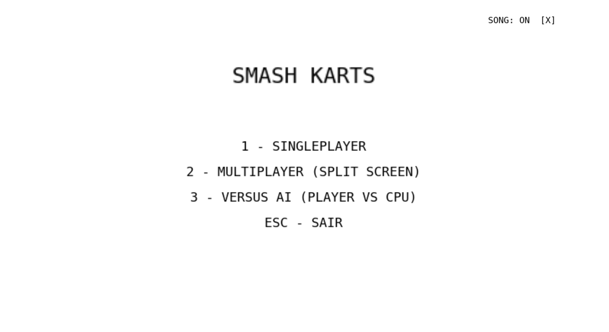
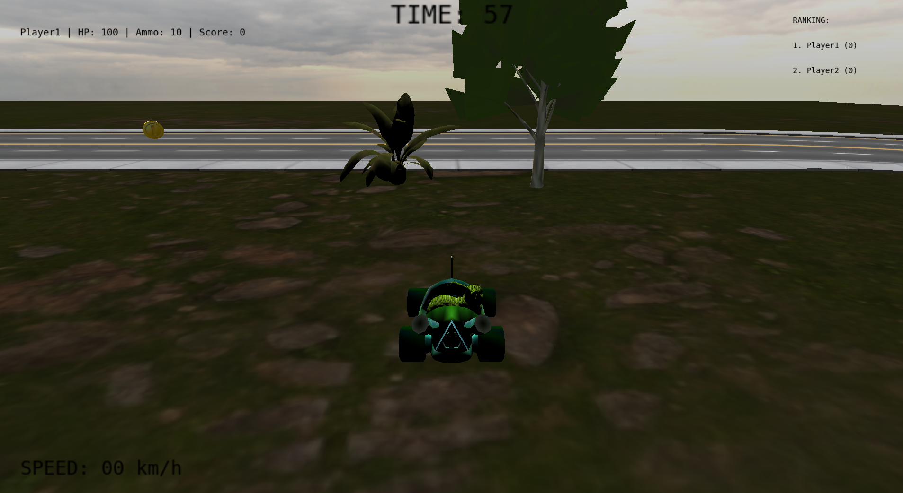
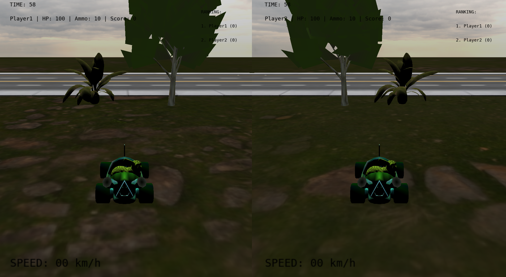
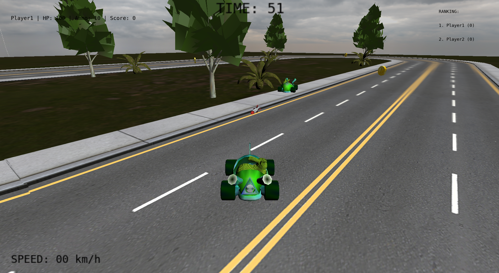
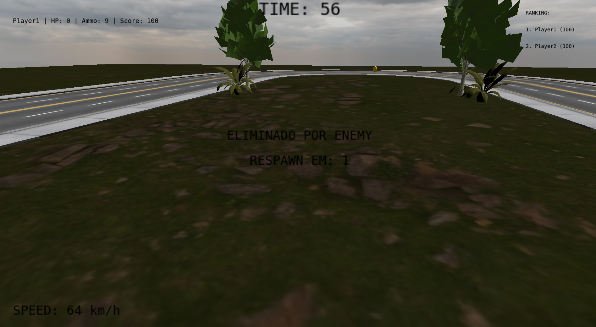
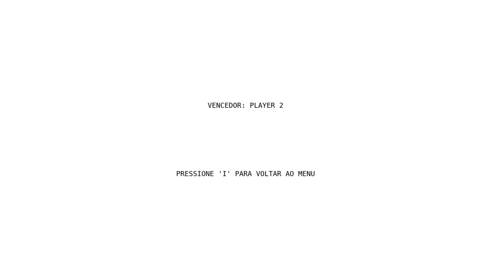

# Smash Karts - Trabalho Final de Fund. de Computação Gráfica, UFRGS.

 Smash Karts é um jogo PVP de carros inspirado em um jogo de mesmo nome [smashkarts.io](smashkarts.io), no qual dois jogadores competem usando veículos controláveis para destruir o adversário, capturar moedas (que viram munição) e dominar o mapa. Cada partida é curta e frenética: os jogadores aceleram e atiram projéteis. O objetivo principal é eliminar o oponente para marcar pontos dentro do tempo limite. No final da partida, quem tiver mais pontos ganha!

Link do Vídeo / Apresentação: https://youtu.be/nxwsponBZwE

 

  
<b style="font-size: 20px;">SUMÁRIO</b>

  <ol>
    <li>
      <a href="#contribution">Contribuição dos Integrantes</a>
    </li>
    <li>
      <a href="#comp">Compilação e Execução</a>
    </li>
    <li>
      <a href="#conceitos">Conceitos de Computação Gráfica</a>
    </li>
    <li>
      <a href="#manualuti">Manual de Utilização da Aplicação</a>
    </li>
    <li>
      <a href="#demo">Demonstração</a>
    </li>
    <li>
      <a href="#ai">Uso de Ferramentas de IA</a>
    </li>
    <li>
      <a href="#assets">Assets Utilizados</a>
    </li>
  </ol>

## 👥 Contribuição dos Integrantes

**Rafael:**
   1. Colisões
   2. Iluminação
   3. Câmeras
   4. Cenário
   5. Organização dos arquivos
   6. Movimentação

**Luísa:**
   1. Curvas de Bézier
   2. Tela inicial
   3. Áudios
   4. Splitscreen
   5. Mensagens na Tela

---

## ⚙️ Compilação e Execução

### **Requisitos**
- CMake instalado
- Compilador C++

### **Passo a Passo da Compilação**
Pressione Alt + F5 ou clique no botão de "Run".

---

## 🧠 Conceitos de Computação Gráfica Aplicados
Durante o desenvolvimento da aplicação, utilizamos diversos conceitos estudados em aula, incluindo:

**Projeção:** perspectiva.

**Transformações geométricas:** model, view e projection.

**Câmeras:** look-at (kart) e livre (ao clicar na tecla C no modo singleplayer).

**Iluminação / Interpolação:** 
- Kart: Lambert (difusa) / Gouraud (por vértice).
- Palmeiras: Lambert (difusa) / Gouraud (por vértice).
- Coelho: Lambert (difusa) / Gouraud (por vértice).
- Árvores: Blinn-Phong (especular) / Gouraud (por vértice).
- Chão: Blinn-Phong (especular) / Phong (por pixel).
- Pista: Blinn-Phong (especular) / Phong (por pixel).
- Moedas: Blinn-Phong (especular) / Phong (por pixel).
- Céu: Global (ambiente) / Phong (por pixel).

**Texturização:** todos os objetos têm texturas e são colocadas no shader_fragment ou no vertex_fragment, dependendo se é Gourad ou Phong.

**Modelagem de objetos:** malhas poligonais a partir de triângulos.

**Intersecções:** 
- Esfera-Esfera: colisão entre os karts
- Ponto-Esfera: colisão entre kart e Moeda
- Esfera-Cubo: colisão entre kart e arvore/palmeira
- Raio-Esfera: colisão entre foguete e kart
- Raio-Cubo: colisão entre foguete e cenário (arvores/palmeiras)

**Animações baseadas no tempo:** todas as animações e movimentações (incluindo a da câmera) dos objetos são baseados em um tempo global, ou seja, não dependem da velocidade da GPU.

**Curva de Bézier:** as moedas se movimentam na pista seguindo a curva cúbica de Bézier.

---

## 🎮 Manual de Utilização da Aplicação

- **W / A / S / D** – movimentação do Player 1
- **↑ / ← / ↓ / →** – movimentação do Player 2
- *Space* – tiro do Player 1
- *Right Shift* – tiro do Player 2
- **I** – voltar para o início (menu)
- **C** – alterar entre câmeras
- *Mouse* – movimentar *free camera* 
- **M** – (des)prende o mouse
- **X** – (des)silenciar áudio
- **ESC** – fechar jogo
- **1** – entrar no modo *singleplayer*
- **2** – entrar no modo *multiplayer*
- **3** – entrar no modo *contra IA*

---

## 🖼️ Demonstrações

### Menu Inicial
No Menu é possível escolher entre três modos de jogo: singleplayer (1), multiplayer (2) e contra IA (3).
O volume do jogo pode ser silenciado na tecla X.

  

### Singleplayer
No modo singleplayer, o usuário se move sozinho pelo mapa podendo pegar moedas, disparar foguetes e acertar o adversário parado. Além disso, nesse modo é possível alterar a câmera (C) look-at do kart para a câmera livre.

  

### Multiplayer
No modo multiplayer, a tela é dividida em duas. O jogador da esquerda se move em WASD e atira na tecla espaço. O jogador da direita se move nas setinhas e atira no shift da direita. 

  

### Versus AI
No modo versus AI, o jogador joga contra um bot. O bot está programado para andar e atirar pelo mapa. Assim que o bot fica sem munição, ele busca moedas para recarregá-las e volta a atirar.

  

### Eliminado
Ao ser eliminado, o jogador recebe uma mensagem sobre sua morte e a contagem de 3 segundos para renascer no mapa.

  

### Vencedor
Após 1 minuto de partida, a partida se encerra e o nome do vencedor aparece na tela. Junto com a instrução de apertar a tecla I para voltar ao menu principal.

  

---

## 🤖 Uso de Ferramentas de IA 
Para o desenvolvimento deste trabalho, a dupla utilizou ferramentas de Inteligência Artificial, especificamente ChatGPT e Gemini, atuando como assistentes de programação e pesquisa. As ferramentas foram empregadas na resolução de problemas de configuração de ambiente (compilação e build), na refatoração de código para modularização de classes e como material de consulta para o aprendizado da biblioteca de áudio e funções específicas do OpenGL. Além disso, auxiliaram na dedução da lógica matemática vetorial para o sistema de colisões e na elaboração da documentação.

Em um modo extra, contra bot, o uso de IA foi essencial para que o bot se portasse de maneira adequada e desafiadora contra um humano. Foi extremamente necessário, dado que a dupla não havia conhecimento prévio para automatizar um bot. Esse modo extra foi feito com o intuito de deixar o jogo mais legal e interativo quando não há duas pessoas para jogá-lo.

Análise crítica: As ferramentas mostraram-se extremamente úteis para acelerar tarefas repetitivas, explicar erros de sintaxe e fornecer esqueletos de código, funcionando como uma documentação interativa eficiente. No entanto, houve uma certa limitação quando as IAs sugeriram códigos em versões antigas da OpenGL. Assim, o uso exigiu revisão e adaptação por parte da dupla para garantir que as ideias se adequassem à arquitetura específica do projeto.

---

## 📦 Assets Utilizados 

### **Modelos 3D (.obj)**
- **Kart:** https://rigmodels.com/model.php?view=Crash_Nitro_Kart-3d-model__RRUK7Z4OZSA792961SVBLJP2O&searchkeyword=kart&manualsearch=1
- **Moeda:** https://rigmodels.com/model.php?view=Coin-3d-model__I89O58TBZ353I4X9ANHTRFF5K&searchkeyword=coin&manualsearch=1
- **Foguete:** https://rigmodels.com/model.php?view=Rocket-3d-model__BBLT6Y289HRMFUPXB4F97YQGM&searchkeyword=bullet&manualsearch=1
- **Palmeira:** https://rigmodels.com/model.php?view=Palm-3d-model__L3NAEA4864VBU6RACQOZNZ43R&searchkeyword=palm&manualsearch=1
- **Árvore:** https://rigmodels.com/model.php?view=Tree-2-N020414-3d-model__LVA2SSG6VH9BJ6DTEGA82K6F3&searchkeyword=tree&manualsearch=1
- **Tracks (pista):** https://3dexport.com/pt/3d-model-modularroadspack-450748
- **Sphere, Bunny e Plane:** fornecidos via *Moodle*

### **Texturas**
- **Céu:** https://polyhaven.com/a/overcast_soil_puresky
- **Chão:** https://polyhaven.com/a/rocky_terrain_02
- **Demais texturas nos mesmos links dos objetos;**

### **Áudios**
- **Música de fundo:** https://royaltyfreemusiclibrary.com/tracks?tracks=axis9999-303
- **Som de moeda:** https://www.youtube.com/watch?v=-oiucsrxixU
- **Som de disparo:** https://www.youtube.com/watch?v=hyLEK0Ox-78
- **Som de explosão:** https://youtu.be/JoC7Ylckrks?si=EmTvI0C1BMQdk5Gd
- **Som de (de)aceleração:** https://elevenlabs.io/pt/sound-effects/tire-screech  

